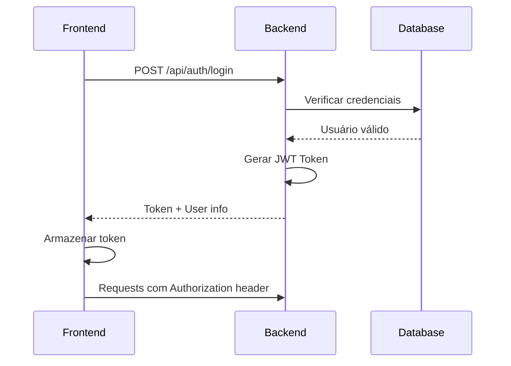
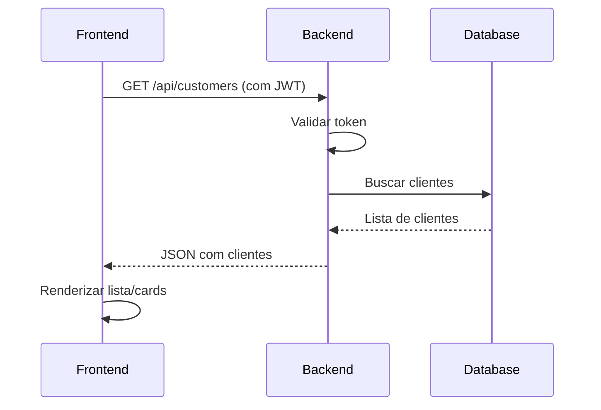

# 📋 Documentação Técnica - Sistema de Cadastro de Clientes

## 🎯 Visão Geral do Projeto

Este documento fornece informações técnicas detalhadas sobre a arquitetura, estrutura e implementação do Sistema de Cadastro de Clientes.

## 🏗️ Arquitetura do Sistema

### **Padrão Arquitetural**
- **Arquitetura**: Cliente-Servidor (Client-Server)
- **Paradigma**: RESTful API
- **Separação**: Frontend SPA + Backend API
- **Comunicação**: HTTP/HTTPS com JSON

### **Fluxo de Dados**
```
[Frontend React] ←→ [HTTP/JSON] ←→ [Backend .NET] ←→ [SQLite DB]
```

## 🔧 Estrutura Técnica Detalhada

### **Backend (.NET 9)**

#### **Controllers**
```csharp
├── AuthController.cs          # Autenticação (Login/Register)
├── CustomersController.cs     # CRUD de Clientes
└── BaseController.cs          # Controlador base
```

#### **Models**
```csharp
├── User.cs                    # Modelo de usuário
├── Customer.cs                # Modelo de cliente
└── CompanyType.cs             # Enum tipos de empresa
```

#### **Services**
```csharp
├── IAuthService.cs            # Interface de autenticação
├── AuthService.cs             # Implementação de autenticação
├── ICustomerService.cs        # Interface de clientes
└── CustomerService.cs         # Implementação de clientes
```

#### **Data**
```csharp
├── AppDbContext.cs            # Contexto do Entity Framework
└── Migrations/                # Migrações do banco
```

### **Frontend (React 18 + TypeScript)**

#### **Componentes**
```typescript
├── components/
│   ├── Header.tsx             # Cabeçalho da aplicação
│   ├── PrivateRoute.tsx       # Proteção de rotas
│   └── Loading.tsx            # Indicador de carregamento
```

#### **Páginas**
```typescript
├── pages/
│   ├── Login.tsx              # Página de login
│   ├── Register.tsx           # Página de registro
│   ├── Customers.tsx          # Listagem de clientes
│   └── Dashboard.tsx          # Dashboard principal
```

#### **Serviços**
```typescript
├── services/
│   ├── api.ts                 # Configuração Axios
│   ├── authService.ts         # Serviços de autenticação
│   └── customerService.ts     # Serviços de clientes
```

#### **Tipos**
```typescript
├── types/
│   ├── User.ts                # Interface de usuário
│   ├── Customer.ts            # Interface de cliente
│   └── ApiResponse.ts         # Interface de resposta da API
```

## 🔐 Segurança Implementada

### **Autenticação JWT**
```csharp
// Configuração JWT no backend
services.AddAuthentication(JwtBearerDefaults.AuthenticationScheme)
    .AddJwtBearer(options => {
        options.TokenValidationParameters = new TokenValidationParameters
        {
            ValidateIssuer = true,
            ValidateAudience = true,
            ValidateLifetime = true,
            ValidateIssuerSigningKey = true,
            ValidIssuer = configuration["Jwt:Issuer"],
            ValidAudience = configuration["Jwt:Audience"],
            IssuerSigningKey = new SymmetricSecurityKey(key)
        };
    });
```

### **Hash de Senhas**
```csharp
// BCrypt para hash de senhas
string hashedPassword = BCrypt.Net.BCrypt.HashPassword(password);
bool isValid = BCrypt.Net.BCrypt.Verify(password, hashedPassword);
```

### **Interceptors HTTP**
```typescript
// Interceptor para adicionar token em requests
api.interceptors.request.use((config) => {
  const token = localStorage.getItem('token');
  if (token) {
    config.headers.Authorization = `Bearer ${token}`;
  }
  return config;
});
```

## 💾 Banco de Dados

### **Esquema SQLite**
```sql
-- Tabela Users
CREATE TABLE Users (
    Id INTEGER PRIMARY KEY AUTOINCREMENT,
    Email TEXT NOT NULL UNIQUE,
    PasswordHash TEXT NOT NULL,
    CreatedAt DATETIME DEFAULT CURRENT_TIMESTAMP
);

-- Tabela Customers
CREATE TABLE Customers (
    Id INTEGER PRIMARY KEY AUTOINCREMENT,
    Cnpj TEXT NOT NULL,
    RazaoSocial TEXT NOT NULL,
    Tipo INTEGER NOT NULL,
    NomeContato TEXT NOT NULL,
    EmailContato TEXT NOT NULL,
    TelefoneContato TEXT NOT NULL,
    ValorHonorario DECIMAL(18,2) NOT NULL,
    Ativo BOOLEAN NOT NULL DEFAULT 1,
    CreatedAt DATETIME DEFAULT CURRENT_TIMESTAMP,
    UpdatedAt DATETIME DEFAULT CURRENT_TIMESTAMP
);
```

### **Entity Framework Configurations**
```csharp
protected override void OnModelCreating(ModelBuilder modelBuilder)
{
    // Configuração de Customer
    modelBuilder.Entity<Customer>(entity =>
    {
        entity.Property(e => e.ValorHonorario)
              .HasColumnType("decimal(18,2)");
        
        entity.Property(e => e.Tipo)
              .HasConversion<int>();
    });
}
```

## 🎨 Sistema de Estilização

### **CSS Responsivo**
```css
/* Breakpoints */
@media (max-width: 768px) {
  .desktop-view { display: none; }
  .mobile-view { display: block; }
}

/* CSS Grid para cards mobile */
.customers-cards {
  display: grid;
  gap: 1rem;
  grid-template-columns: 1fr;
}
```

### **Variáveis CSS**
```css
:root {
  --primary-color: #DB6838;     /* Laranja Lucrare */
  --success-color: #28a745;     /* Verde */
  --danger-color: #dc3545;      /* Vermelho */
  --warning-color: #ffc107;     /* Amarelo */
  --dark-color: #4a5568;        /* Cinza escuro */
}
```

## 🔄 Fluxos de Operação

### **Fluxo de Autenticação**


### **Fluxo CRUD de Clientes**


## 📊 Performance e Otimizações

### **Frontend**
- **Lazy Loading**: Componentes carregados sob demanda
- **Memoização**: React.memo em componentes
- **Debounce**: Busca em tempo real com delay
- **Virtual DOM**: Otimização automática do React

### **Backend**
- **Entity Framework**: ORM otimizado
- **Async/Await**: Operações não-bloqueantes
- **CORS**: Configuração otimizada
- **JSON Serialization**: Configuração customizada

### **Banco de Dados**
- **Índices**: Em campos de busca frequente
- **Transações**: Para operações críticas
- **Connection Pooling**: Gerenciado pelo EF Core

## 🧪 Testes e Validação

### **Validações Frontend**
```typescript
// Validação de email
const emailRegex = /^[^\s@]+@[^\s@]+\.[^\s@]+$/;

// Validação de CNPJ
const cnpjRegex = /^\d{2}\.\d{3}\.\d{3}\/\d{4}\-\d{2}$/;
```

### **Validações Backend**
```csharp
[Required(ErrorMessage = "CNPJ é obrigatório")]
[RegularExpression(@"^\d{14}$", ErrorMessage = "CNPJ deve ter 14 dígitos")]
public string Cnpj { get; set; }

[Required]
[EmailAddress]
public string EmailContato { get; set; }
```

## 🚀 Deploy e Produção

### **Configurações de Produção**

#### **Backend**
```json
{
  "ConnectionStrings": {
    "DefaultConnection": "Data Source=production.db"
  },
  "Jwt": {
    "Key": "[PRODUCTION_SECRET_KEY]",
    "Issuer": "CadastroClientesAPI",
    "Audience": "CadastroClientesClient",
    "ExpiryInDays": 7
  }
}
```

#### **Frontend**
```typescript
// Configuração para produção
const API_BASE_URL = process.env.NODE_ENV === 'production' 
  ? 'https://api.seudominio.com' 
  : 'https://localhost:7259';
```

### **Scripts de Build**
```bash
# Backend
dotnet publish -c Release -o ./publish

# Frontend
npm run build
```

## 📋 Checklist de Qualidade

### ✅ **Funcionalidades**
- [x] Autenticação JWT
- [x] CRUD completo de clientes
- [x] Interface responsiva
- [x] Sistema de busca
- [x] Validação de dados

### ✅ **Segurança**
- [x] Hash de senhas com BCrypt
- [x] Validação de tokens JWT
- [x] Sanitização de inputs
- [x] CORS configurado
- [x] HTTPS em produção

### ✅ **Performance**
- [x] Lazy loading
- [x] Otimização de re-renders
- [x] Compressão de assets
- [x] Cache de HTTP requests

### ✅ **Usabilidade**
- [x] Design responsivo
- [x] Feedback visual
- [x] Mensagens de erro claras
- [x] Loading states
- [x] Navegação intuitiva

---

**📝 Documento mantido por**: Thiago Thimoteo  
**📅 Última atualização**: 15/10/2025  
**🔖 Versão**: 1.0.0